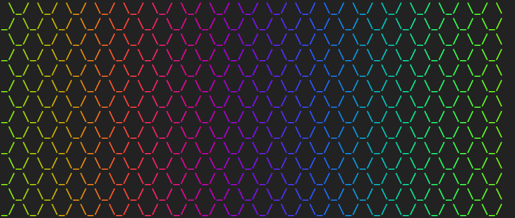
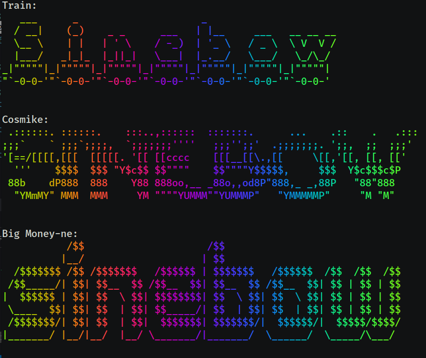
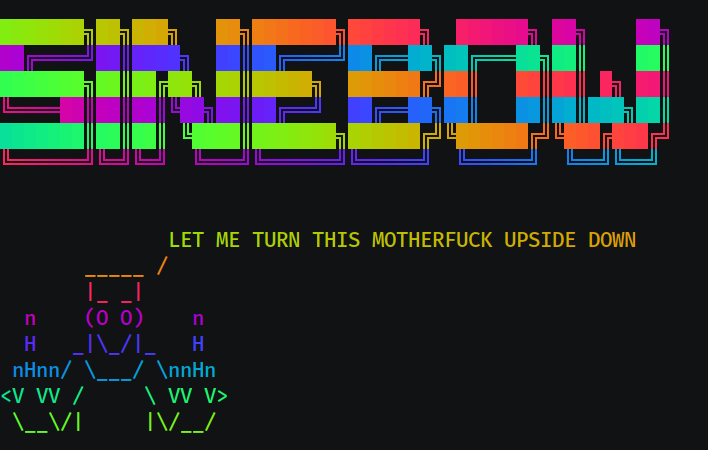

# Sinebow

Sexifies strings with a fancy rainbro effect created using out-of-phase sine wave cycles from this awesome [tutorial](https://krazydad.com/tutorials/makecolors.php).

---

## Install

```
go get -u github.com/traviscampbell/sinebow/...
```

---

## Usage

### Use as a command line program

```bash
$ seq -s " \\_/" 256 | tr -d "0-9" | fold -70 | sinebow
```



### Use as a library

```golang
package main

import (
    "fmt"
    "github.com/traviscampbell/sinebow"
)

func main() {
    fmt.Println(sinebow.Rainbro("Go Fuck Yourself, Cuffy!"))
    fmt.Println(sinebow.RainbroBG("Go Fuck Yourself, Cuffy!"))
}
```

The included [example](example/example.go) snippet demonstrates the difference between sexifying slices of strings and multiline strings.

Output of example code below:


